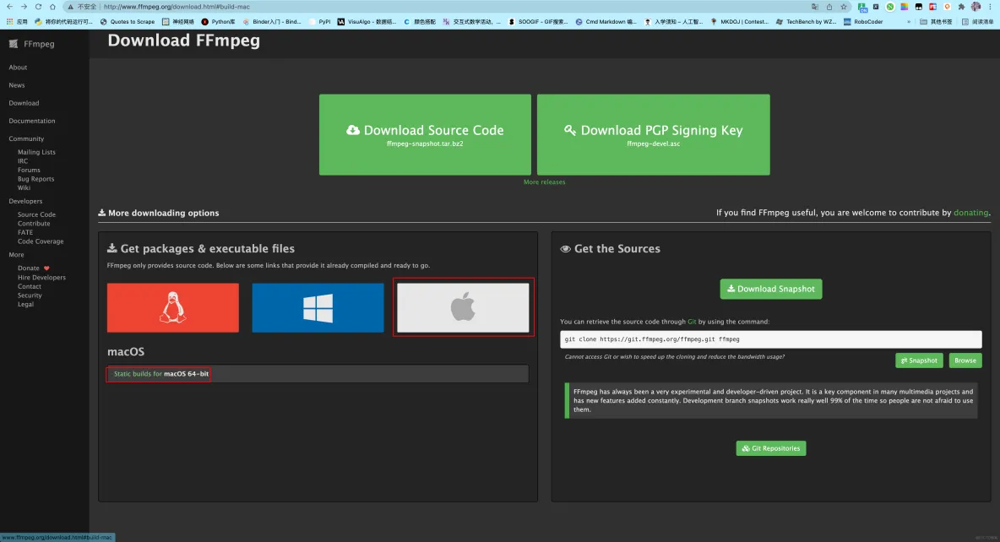
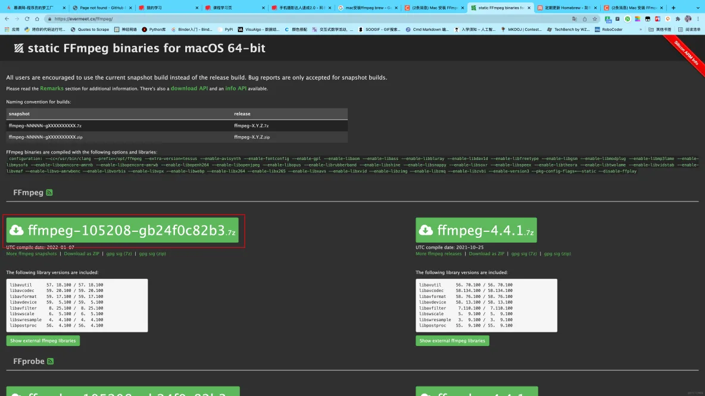
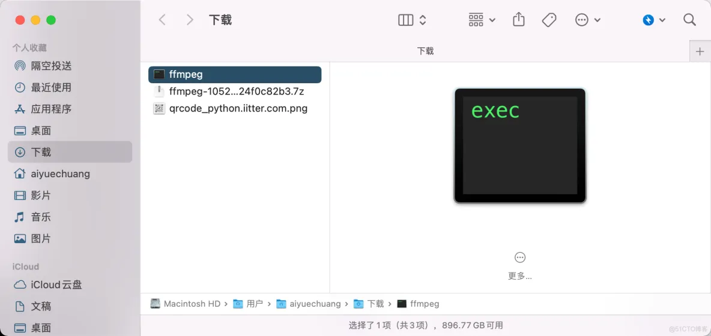

## 背景

在 Web 中使用 video 标签，如果需要兼容多个浏览器，建议使用 mp4 h.264 编码格式。

如果 mp4 文件无法在浏览器中播放，很可能是编码格式不对，可通过 ffmpeg 进行转换。

## ffmpeg 安装

- 访问 ffmpeg 官网，进入[下载页面](https://www.ffmpeg.org/download.html)
  
- 选择需要的版本
  
- 解压（也可添加到环境变量）
  

## ffmpeg 转换

```sh
~/Downloads/ffmpeg -i input.mp4 -vcodec h264 output.mp4
```

## 参考文档

- https://blog.51cto.com/aiyc/5151109
