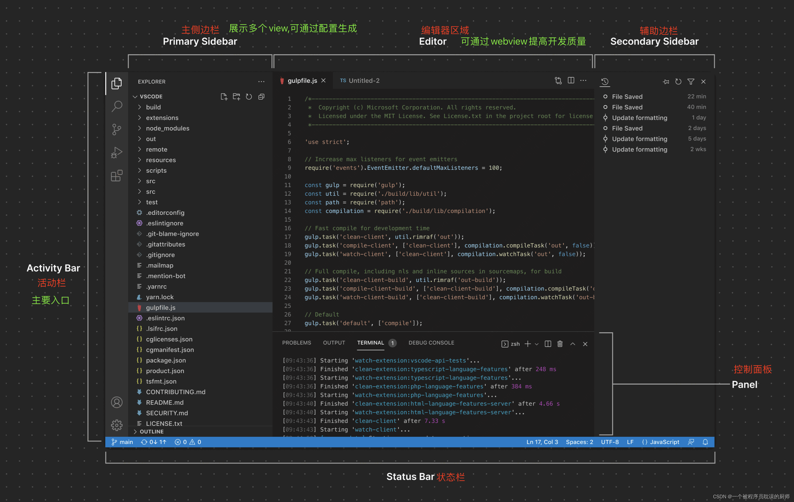
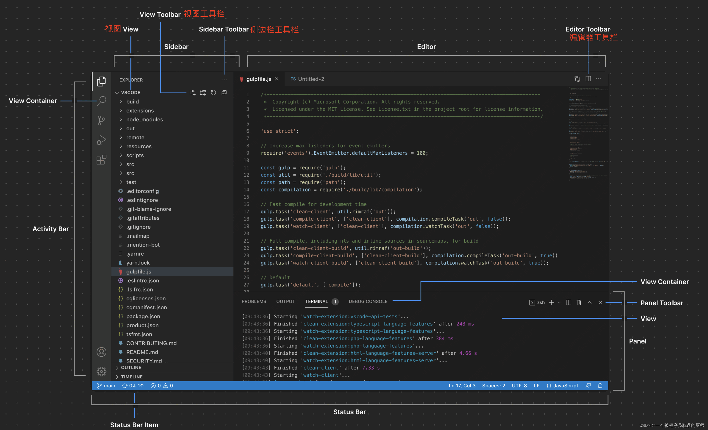
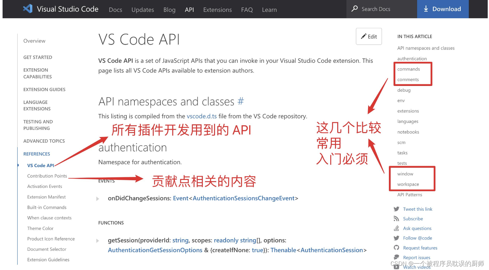
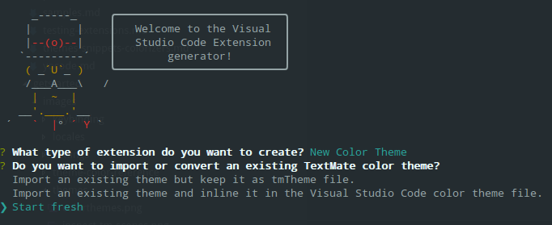
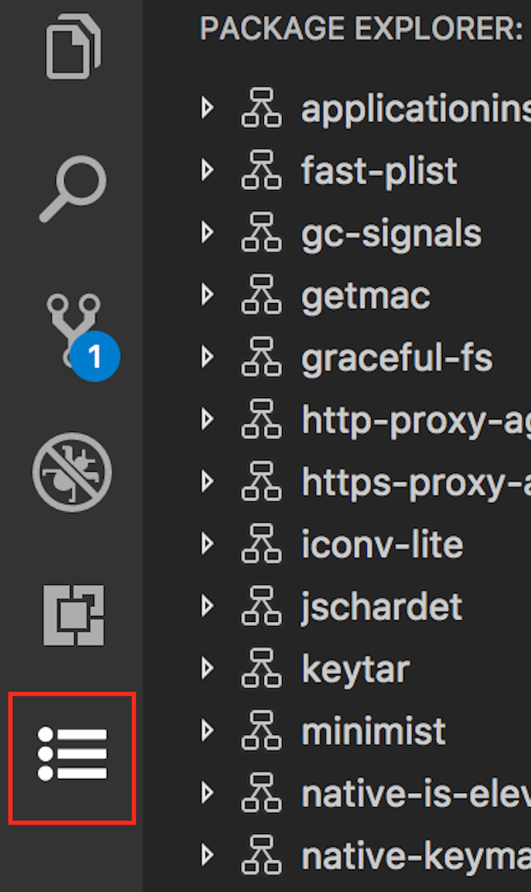
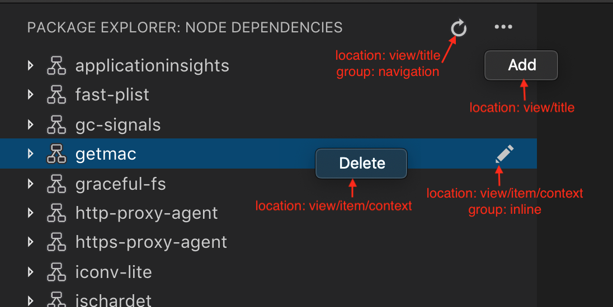
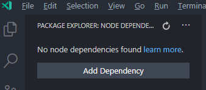
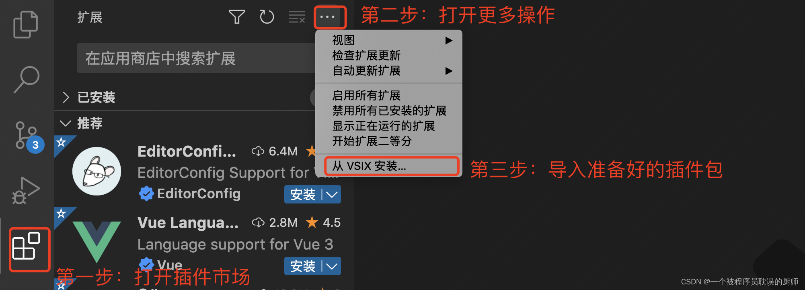

## 功能区域




## 插件能力

- 插件
- 主题

## 开发指南

[官网文档地址](https://code.visualstudio.com/api/references/vscode-api)



### 命令行

- 安装工具并初始化

```sh
npm i -g generator-code yo
npx yo code
```

- 调试插件
  - 进入插件根目录，F5 或者启用 Debug（会打开一个新的窗口）
  - 在新窗口中，Command + Shift + P，输入插件注册的 command（Hello World）
  - 修改插件源码后，在调试新窗口中（Command + Shift + P），Reload Window 即可


### 颜色主题

- 安装工具并初始化

```sh
npm i -g yo generator-code
npx yo code
```



- 测试主题插件
  - 进入插件根目录，F5 或者启用 Debug（会打开一个新的窗口）
  - 在新窗口中，Code > Preferences > Theme > Color Theme，可以看到颜色主题在列表中

### TreeView

> [参考 Demo](https://github.com/microsoft/vscode-extension-samples/tree/main/tree-view-sample)

- 配置 package.json 中的 contributes

```json
{
  "contributes": {
    "commands": [
      {
        // 刷新按钮命令
        "command": "nodeDependencies.refreshEntry",
        "title": "Refresh",
        "icon": {
          "light": "resources/light/refresh.svg",
          "dark": "resources/dark/refresh.svg"
        }
      }
    ],
    "menus": {
      // 配置菜单按钮用于更新
      "view/title": [
        {
          "command": "nodeDependencies.refreshEntry",
          "when": "view == nodeDependencies",
          "group": "navigation"
        }
      ]
    },
    "views": {
      "explorer": [
        // 资源管理视图中增加依赖查看
        {
          "id": "nodeDependencies", // id与extension.ts中的registerTreeDataProvider对应
          "name": "Node Dependencies"
        }
      ]
    }
  }
}
```

其中 views 下面的属性说明如下：

```text
explorer: 侧栏中的资源管理器视图
debug: 侧栏中的运行和调试视图
scm: 侧栏中的源代码管理视图
test: 侧栏中的测试资源管理器视图
```

- 增加[nodeDependencies](https://github.com/microsoft/vscode-extension-samples/blob/main/tree-view-sample/src/nodeDependencies.ts)，并在 extension.ts 中引用

```typescript
import { DepNodeProvider, Dependency } from "./nodeDependencies";

export function activate(context: vscode.ExtensionContext) {
  // sample of tree view
  const rootPath =
    vscode.workspace.workspaceFolders &&
    vscode.workspace.workspaceFolders.length > 0
      ? vscode.workspace.workspaceFolders[0].uri.fsPath
      : undefined;
  console.log("rootPath: " + rootPath);

  const nodeDependenciesProvider = new DepNodeProvider(rootPath);
  vscode.window.registerTreeDataProvider(
    "nodeDependencies", // 此处需要与contributes中的views id对应
    nodeDependenciesProvider
  );

  // 注册命令以便刷新依赖树
  vscode.commands.registerCommand("nodeDependencies.refreshEntry", () =>
    nodeDependenciesProvider.refresh()
  );
}
```

#### 查看容器及视图配置

可以配置按钮在最左侧的查看容器中：



- 配置 package.json 的 contributes

```json
{
  "contributes": {
    "commands": [
      {
        // 刷新按钮命令
        "command": "nodeDependencies.refreshEntry",
        "title": "Refresh",
        "icon": {
          "light": "resources/light/refresh.svg",
          "dark": "resources/dark/refresh.svg"
        }
      }
    ],
    "menus": {
      // 配置菜单按钮用于更新
      "view/title": [
        {
          "command": "nodeDependencies.refreshEntry",
          "when": "view == nodeDependencies",
          "group": "navigation"
        }
      ]
    },
    "viewsContainers": {
      // 查看容器中新增自定义视图容器
      "activitybar": [
        {
          "id": "package-explorer",
          "title": "Package Explorer",
          "icon": "media/dep.svg"
        }
      ]
    },
    "views": {
      // 向自定义视图容器中提供视图
      "package-explorer": [
        {
          "id": "nodeDependencies", // 视图id与extension.ts中的registerTreeDataProvider对应
          "name": "Node Dependencies",
          "icon": "media/dep.svg",
          "contextualTitle": "Package Explorer"
        }
      ]
    }
  }
}
```

#### 查看操作

配置操作可作为单个树项目上、树项目上下文菜单中以及视图顶部视图标题中的内嵌图标使用。



```json
{
  "contributors": {
    "menus": {
      "view/title": [
        {
          "command": "nodeDependencies.refreshEntry",
          "when": "view == nodeDependencies",
          "group": "navigation"
        },
        {
          "command": "nodeDependencies.refreshEntry",
          "when": "view == nodeDependencies"
        }
      ],
      "view/item/context": [
        {
          "command": "nodeDependencies.refreshEntry",
          "when": "view == nodeDependencies",
          "group": "inline"
        },
        {
          "command": "nodeDependencies.refreshEntry",
          "when": "view == nodeDependencies"
        }
      ]
    }
  }
}
```

#### 欢迎内容

如果视图为空，或者想要将欢迎内容添加到另一个扩展程序的空视图中，则可以配置。



```json
{
  "contributors": {
    "viewsWelcome": [
      {
        "view": "nodeDependencies",
        "contents": "No node dependencies found [learn more](https://www.npmjs.com/).\n[Add Dependency](command:nodeDependencies.addEntry)"
      }
    ]
  }
}
```

## 发布插件

- 源码共享
- 发布到插件市场
- 打包成 vsix 包

### 打包 vsix 包

- 插件根目录下执行如下命令即可生成 vsix 包：

```sh
vsce package
```

### 安装 vsix 包


