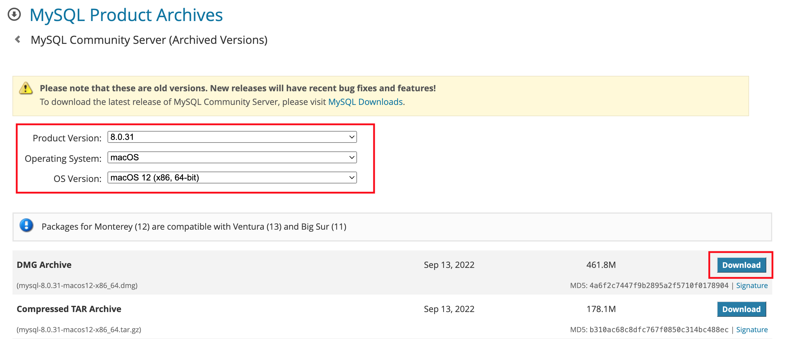
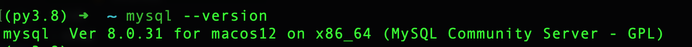
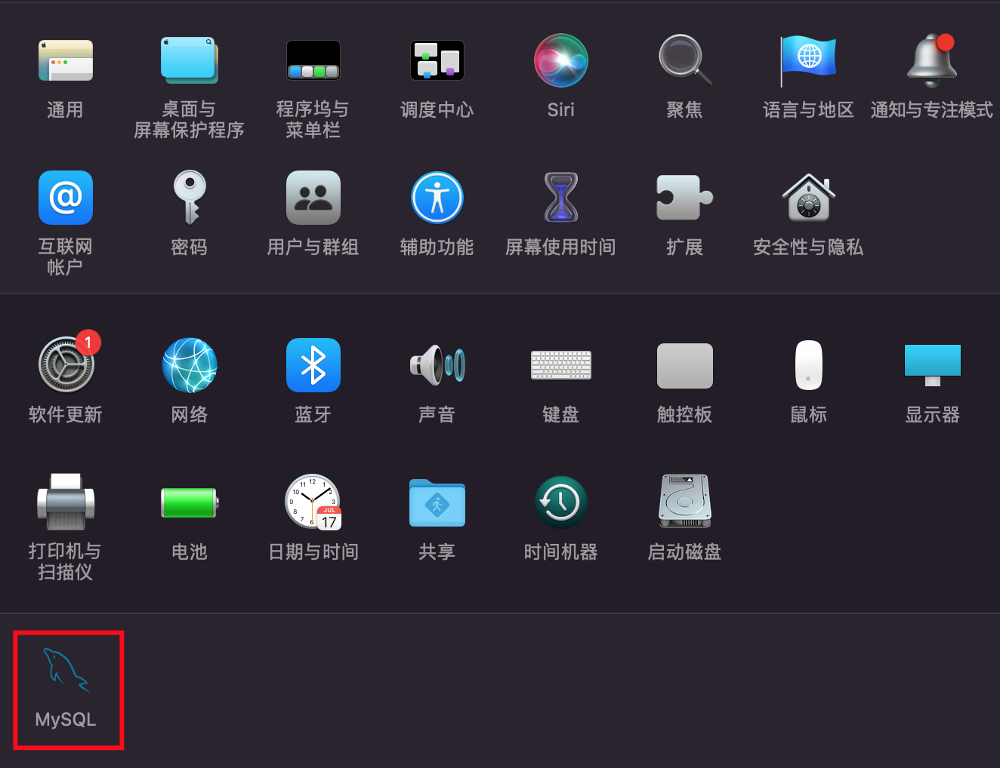
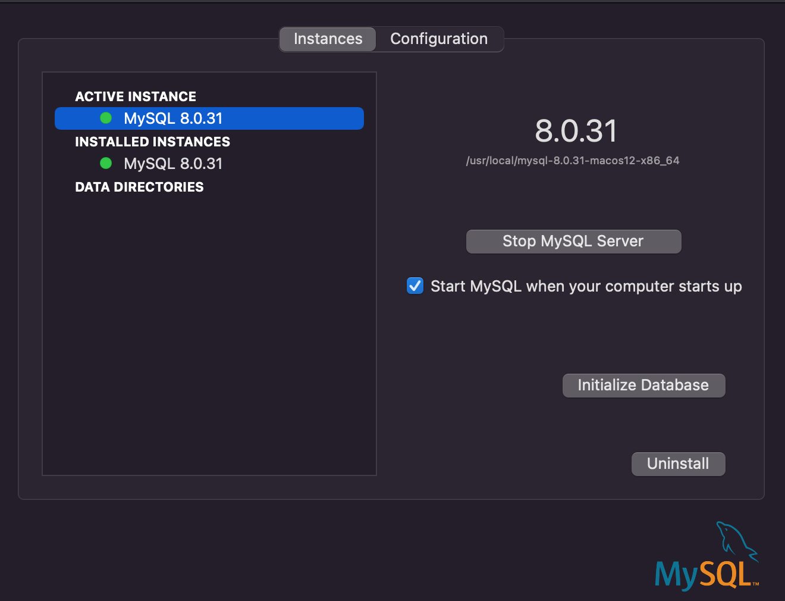

## 安装 MySQL

> MacOS12

- [下载 MySQL Community](https://downloads.mysql.com/archives/community/)，选择 8.0.31，x86_64
  
- 安装初始化 root 密码，至少 8 位。
- 配置环境变量

  ```sh
  vi ~/.zshrc
  ```

  ```text
  # mysql
  export PATH=$PATH:/usr/local/mysql/bin
  ```

- 生效

  ```sh
  source ~/.zshrc
  ```

- 测试

  ```sh
  mysql --version
  ```

  

- 关闭 MySQL 服务
  
  

## MySQL 客户端连接

推荐以下客户端：

- [DBeaver Community](https://dbeaver.io/download/#macos)
- [MySQL Workbench](https://downloads.mysql.com/archives/workbench/)，选择 8.0.31

## 常见问题

在使用客户端连接时，遇到如下问题，将 `allowPublicKeyRetrieval=true` 即可

```log
com.mysql.jdbc.exceptions.jdbc4.MySQLNonTransientConnectionException: Public Key Retrieval is not allowed
```
