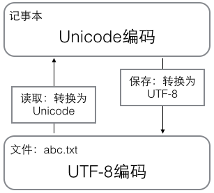

## 基础

- input('提示文本')可以接收交互式命令行输入。
- Python 是大小写敏感的。

## 数值

- 整数类型可以在数字中添加\_用来分隔数字，例如 100000 和 100_000 是等价的。
- 整数运算永远是精确的，浮点数运算存在四舍五入的误差，除法计算结果是浮点数，即使是两个整数恰好整除，结果也是浮点数。
- 整数的地板除//永远是整数，即使除不尽（10 // 3 == 3）；余数运算，可以得到两个整数相除的余数（10 % 3 == 1）。
- Python 的浮点数也没有大小限制，但是超出一定范围就直接表示为 inf（无限大）。
- 转义字符 \ 可以转义很多字符，python 提供了 r''表示''内部的字符串默认不转义。
- 如果字符串内部有很多换行，用\n 写在一行里不好阅读，python 允许用'''...'''的格式表示多行内容。
- python 的布尔类型值为 True/False，布尔运算符用 and、or 和 not 运算（不是 &&, ||, !）。
- 空值是 python 中一个特殊值，用 None 表示，不同于 0。

## 变量

- 变量名必须是大小写英文、数字和\_的组合，且不能用数字开头。
- 等号=是赋值语句，可以把任意数据类型赋值给变量，同一个变量可以反复赋值，而且可以是不同类型的变量。
- 常量就是不能变的变量，全部大写的变量名表示常量只是一个习惯上的用法，根本没有任何机制保证 PI 不会被改变。

## 字符串

- 计算机要处理文本，就必须先把文本转换为数字才能处理，通常用一串数字对文本进行编码。
- 计算机 8 比特位（bit）为一个字节（byte）——最大整数是 2^8-1=255。
- 通常的字符编码有 ASCII（一个字节） 和 Unicode （通常 2 个字节，特殊语言符号用 4 个字节）
- UTF8 可变长编码：把一个 Unicode 字符根据不同的数字大小编码成 1-6 个字节，常用的英文字母被编码成 1 个字节，汉字通常是 3 个字节，只有很生僻的字符才会被编码成 4-6 个字节。如果你要传输的文本包含大量英文字符，用 UTF-8 编码就能节省空间。
- 在计算机内存中，统一使用 Unicode 编码，当需要保存到硬盘或者需要传输的时候，就转换为 UTF-8 编码。例如：用记事本编辑的时候，从文件读取的 UTF-8 字符被转换为 Unicode 字符到内存里，编辑完成后，保存的时候再把 Unicode 转换为 UTF-8 保存到文件：

  

- ord()函数获取字符的整数（十进制）表示，chr()函数把编码转换为对应的字符。
- 通过字符串''.encode('utf-8')或 b'\xe4'.decode('utf-8')来对字符串和字节编码之间转换。
- % 运算符就是用来格式化字符串的，与 C 语言 printf 类似，如果格式化中存在%字符，则通过%%转义最终显示%。
- 另一种格式化字符串是：使用字符串的 format()方法，它会用传入的参数依次替换字符串内的占位符{0}、{1}。
- 另一种格式化字符串是：以 f 开头的字符串称之为 f-string，它和普通字符串不同之处在于字符串如果包含{xxx}，就会以对应的变量替换。

## 列表

- 列表是一种有序的集合，其中的元素可以是不同类型的，元素也可以是另一个 list，通过[]声明：list = ['Joe', 'Jack', 123];
- len()输出列表的元素个数，例如：len(list) == 3
- 取出列表元素，list[0]，索引值以 0 开头；也可以通过-1 取出列表最后一个元素，-2 是倒数第二个以此类推。
- 当索引超出了范围时，Python 会报一个 IndexError 错误。
- list.append()列表末尾插入，list.insert(index, element)指定索引位置插入，list.pop()删除末尾元素，list.pop(index)删除指定索引的元素。

## 元组

- 元组与列表类似，但是元组一旦创建不能修改，即元组中元素的指向不变，如果元素是列表，修改元组中列表内容是可以的。通过()声明：t = ('Joe', 'Jack');
- 在显示只有 1 个元素的 tuple 时，也会加一个逗号,，以免你误解成数学计算意义上的括号。定义 t=(1,)才是一个元组，t=(1)其实是 t=1。

## 条件判断

- 条件语句在判断空 list 和空 tuple 时，也会认为是 False

## 模式匹配

> python3.10 之上才支持

- match case，case \_: 表示匹配任意值

## 循环

- 循环有两种，一种是 for...in 循环，依次把 list 或 tuple 中的每个元素迭代出来；另一种一种是 while 循环。
- range(number)函数生成从 0 开始的 number 个数字序列。list()函数可以将变量转换成 list 类型。
- break 语句可以在循环过程中直接退出循环，而 continue 语句可以提前结束本轮循环，并直接开始下一轮循环。

## with 语句

[深入理解 with 语句](https://www.biaodianfu.com/python-with.html)

```python
with expression [as variable]:
    with-block
```

## 字典 dict

- python 中的字典类似于 JavaScript 中的对象，通过 dict = { "a": 1, "b": 2}
- 判断某个值是否在字典中：'value' in dict
- 通过 get 方法获取值并给出一个默认值：dist.get('c', 3)
- 通过 pop(key)方法，对应的 value 也会从 dict 中删除

## 不重复集合 set

- set 是一组 key 的集合，且不能重复，set 可以看成数学意义上的无序和无重复元素的集合。
- 要创建一个 set，需要提供一个 list 作为输入集合，若 list 中有重复元素，则会自动过滤掉。例如 s = set([1,1,2,3])
- s.add(element)添加元素
- s.remove(element)删除元素
- set 中不可放入可变元素，例如 list，也就是说 s.add([1,2])会报错

## 总结

- `list`（列表）是一种有序的可变序列，可以存储任意类型的元素。列表使用方括号`[]`来表示，元素之间用逗号`,`分隔。列表支持索引、切片、添加、删除、修改等操作，是 Python 中最常用的数据类型之一。

- `tuple`（元组）是一种有序的不可变序列，可以存储任意类型的元素。元组使用圆括号`()`来表示，元素之间用逗号`,`分隔。元组支持索引、切片等操作，但不支持添加、删除、修改等操作。元组通常用于存储不可变的数据，如坐标、颜色等。

- `dict`（字典）是一种无序的键值对集合，可以存储任意类型的键和值。字典使用花括号`{}`来表示，每个键值对之间用冒号`:`分隔，键值对之间用逗号`,`分隔。字典支持通过键来访问值，也支持添加、删除、修改等操作。字典通常用于存储具有映射关系的数据，如姓名和电话号码的对应关系。

- `set`（集合）是一种无序的元素集合，可以存储任意类型的元素。集合使用花括号`{}`来表示，元素之间用逗号`,`分隔。集合支持添加、删除、交集、并集、差集等操作。集合通常用于去重、交集、并集等操作。

需要注意的是，`list`、`tuple`、`dict`和`set`是不同的数据类型，它们之间不能直接进行转换。如果需要将它们之间进行转换，需要使用相应的转换函数，如`list()`、`tuple()`、`dict()`和`set()`。

## 类型转化

- int(), float(), str(), bool()

## 函数

- Python 提供了许多内置函数：https://docs.python.org/3.8/library/functions.html
- 函数别名：可以把函数名赋给一个变量，相当于给这个函数起了一个“别名”，同样可以通过别名进行函数调用
- 函数定义使用 def 语句，依次写出函数名、括号、括号中的参数和冒号:，若只有 return，则返回值为 None
- 如果想定义一个什么事也不做的空函数，可以用 pass 语句。
- 函数可以返回多个值，用逗号分割，此时函数返回值作为一个元祖类型返回。读取的时候也是逗号分割，作为元祖类型返回值的解析。
- 抛出异常用 raise 语句，检查变量类型用 isinstance(x, (int, float))
- 可变参数：在函数定义时，在参数前面加一个\*号，在函数内部，该参数接收到的是一个元祖类型的参数集合。
- 命名关键字参数，在函数定义时，在参数前面加两个\*号，在函数内部，该参数自动组装为一个字典类型的参数集合。类似 JavaScript 中的函数定义 function f(a, ...p) {}；在函数调用时，如果是 list 或者 tuple 类型，可以在变量前加\*号转换为函数可变参数传入，类似 JavaScript 中的函数调用 f(...p)。命名关键字参数必须传入参数名。
- 参数定义的顺序必须是：必选参数、默认参数、可变参数、命名关键字参数和关键字参数。
- 函数对象有一个**name**属性（注意：是前后各两个下划线），可以拿到函数的名字。

## 尾递归

- 递归是指在函数的定义中使用函数自身的一种方法，函数调用自身即称为递归。
- **递归函数有可能触发调用栈溢出，通过尾递归调用解决调用栈溢出问题。**
- 尾调用是函数式编程中一个很重要的概念，当一个函数执行时的最后一个步骤是返回另一个函数的调用（不含表达式），这就叫做尾调用。
- 尾递归的本质实际上就是将方法需要的上下文通过方法的参数传递进下一次调用之中，以达到去除上层依赖，从而消除调用栈溢出问题。
- 慎用直接递归的方式，不仅会带来极差的运行效率，同时会导致浏览器直接无响应。尾递归有着与循环同样优秀的计算性能，使用尾递归可以同时拥有着循环的性能以及递归的数学表达能力。
- **Python 标准的解释器没有针对尾递归做优化，任何递归函数都存在栈溢出的问题。**

## 函数切片

- 函数切片主要是快速截取 list 和 tuple 的部分元素
- 列表快速读取：list[from:to]，截取从 from 索引到 to 索引为止，不包含 to 索引元素，其中索引可以为负数（-1 代表倒数第一个元素，-2 代表倒数第二个元素）
- list[from:to:step]，表示截取从 from 到 to 为止，每隔 step 取一个。
- list[:]可快速复制列表。
- 字符串也可以通过切片访问：'abcdefg'[0:1]

## 函数迭代

- 函数迭代主要是能够遍历 list、tuple 和 dict 类型的元素
- for in 语句可以遍历读取 list 和 tuple 的每个元素，若需要遍历 dict 类型的值，需要 for in dict.values()
- 列表遍历如果想要同时读取索引及值，可使用 for index,value in enumerate(['A', 'B', 'C'])
- 字典遍历如果想要同时读取 key 及 value，可使用 for key,value in {"x": "a", "y": "b"}.items()
- 字符串也可使用迭代方法遍历读取每个字符
- 判断变量是否是可迭代，可使用 from collections.abc import Iterable;isinstance('abc', Iterable)

## 列表生成式

- 列表生成式用于创建列表时使用
- range 函数能够快速创建列表数组
- list(range(1, 11))
- [x * x for x in range(1, 11) if x % 2 == 0]

## 迭代器

- 如果一个函数定义中包含 yield 关键字，那么这个函数就不再是一个普通函数，而是一个 generator 函数

## 高阶函数

- 函数本身也可以赋值给变量，即：变量可以指向函数。
- 由于 abs 函数实际上是定义在 import builtins 模块中的，所以要让修改 abs 变量的指向在其它模块也生效，要用 import builtins; builtins.abs = 10
- 一个函数就可以接收另一个函数作为参数，这种函数就称之为高阶函数。
- 高阶函数除了可以接受函数作为参数外，还可以把函数作为结果值返回。
- map 和 reduce 函数可以针对 list 进行处理，map()函数接收两个参数，一个是函数，一个是 Iterable，返回值也是一个 Iterable
- filter 函数用于过滤序列 list
- 当一个函数返回了一个函数后，其内部的局部变量还被新函数引用，返回的这个函数就称为闭包。
- **使用闭包时，对外层变量赋值前，需要先使用 nonlocal 声明该变量不是当前函数的局部变量。**
- 通过 lambda 语句可以定义匿名函数，将匿名函数赋给变量，通过该函数可以使用该匿名函数定义；
- 要增强函数的功能但又不希望修改函数的定义，这种在代码运行期间动态增加功能的方式，称之为“装饰器”（Decorator）。
- functools.partial 的作用是把一个函数的某些参数给固定住（也就是设置默认值），返回一个新的函数，调用这个新函数会更简单。

## 模块

标准模块模板

```python
#!/usr/bin/env python3
# -*- coding: utf-8 -*-

'a test module'
__author__ = 'Miles'

```

- 模块第一行的字符串被定义为模块的文档注释，文档注释可以用特殊变量\_\_doc\_\_访问
- \_\_name\_\_=='\_\_main\_\_' 当通过命令行模式运行模块时，会注入\_\_name\_\_ = '\_\_main\_\_'。
- 在模块中会定义多个函数和变量，正常的函数和变量名是公开的（public），可以被直接引用，有的函数和变量我们希望仅仅在模块内部使用，可通过\_前缀来实现的，通过\_前缀声明的变量也是可以被外部调用的，这里只是一个人为的约定。
- 模块搜索路径：当试图加载一个模块时，Python 会在指定的路径下搜索对应的.py 文件，如果找不到，就会报错。Python 解释器会搜索当前目录、所有已安装的内置模块和第三方模块，搜索路径存放在 sys 模块的 path 变量中
- from package import module 可以从模块中导入子模块
- from ..directory import module 可以在定义模块时引用相对路径的模块

## 工程化

- \_\_init\_\_.py 文件让 Python 将包含该文件的目录视为包。
- \_\_init\_\_.py 文件中的\_\_all\_\_=[]变量，会对 from package import \* 产生影响，
